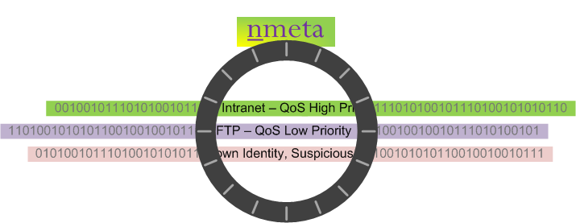
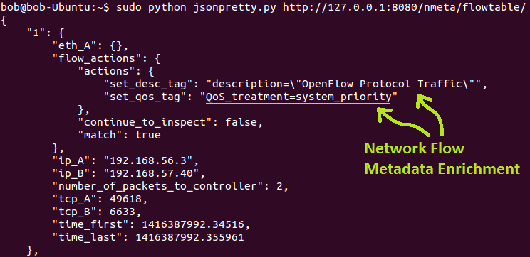

# nmeta - Network Metadata

The nmeta project is founded on the belief that innovation in enterprise networks requires a foundation layer of knowledge about both the participants and their types of conversation. The production of this enriched network metadata requires policy-based control and ability to adapt to new purposes through extensibility. 

Enriched network metadata has a number of uses, including classifying flows for Quality of Service (QoS), traffic engineering and security.



Nmeta is a research platform for traffic classification on Software Defined Networking (SDN).  It runs on top of the Ryu SDN controller (see: http://osrg.github.io/ryu/). One day it may even be good enough to run in a real enterprise network...

# Design Philosophy

The collection and enrichment of flow metadata should be decoupled from
systems that consume it. This abstraction is intended to encourage the
development of innovative new uses for flow metadata.

Policy is used to control how traffic classifiers of many types
(i.e. this is a multiclassifier system) are employed and what actions
they can take.

Flow metadata can be enriched by the policy-controlled classifiers - i.e.
extra data can be added.

The system is designed to work in an online mode such that classifications are
made in a timely manner so that consuming systems may take actions while
the flow is still newly active.

# Installation

Note: see wiki page for full instructions for [Installing on Ubuntu](https://github.com/mattjhayes/nmeta/wiki/Installing-on-Ubuntu)

1) Prerequisites:
As a prerequisite, install Git, Python, python-yaml and Ryu on a Linux system.

2) Install nmeta:
From the home directory on server that has Ryu installed:

```
mkdir nmeta
git clone https://github.com/mattjhayes/nmeta.git
```

3) Fix LLDP bug (optional)
The lldp.py packet library module supplied with Ryu has 
(at the time of writing) a bug related to parsing system
capabilities. A modified version of this file can be 
copied over the original to fix this.

First back up the original lldp.py file:

```
cp ryu/ryu/lib/packet/lldp.py ryu/ryu/lib/packet/lldp.py.original
```

Now overwrite lldp.py with the modified file:

```
cp nmeta/lldp-fixed.py ryu/ryu/lib/packet/lldp.py
```
    
4) Run nmeta:
Navigate to the Ryu root directory:

```
cd
cd ryu
```

Run nmeta:

```
PYTHONPATH=. ./bin/ryu-manager ../nmeta/nmeta.py
```

# Configuration

Configuration files are in the config subdirectory and are written
in YAML ("YAML Ain't Markup Language") format
(see: http://www.yaml.org/spec/1.2/spec.html)

## General Configuration

The general configuration parameters are stored in the file:

```
config/config.yaml
```

## Traffic Classification Configuration

Traffic Classification (TC) configuration parameters are stored in the file:

```
config/tc_policy.yaml
```

### Static Classifiers

TBD
  
### Identity Classifiers

  All identity classifiers are prefixed with 'identity_'
  LLDP systemname may be matched as a regular expression
  The match pattern must be contained in single quotes
    Example:
    -------
    To match system names of *.audit.example.com add this policy condition:
    
```
identity_lldp_systemname_re: '.*\.audit\.example\.com'
```

### Statistical Classifiers

  All statistical classifiers are prefixed with 'statistical_'

TBD - more here
  
### Payload Classifiers

TBD

## QoS Configuration

Quality of Service (QoS) configuration parameters are stored in the file:

```
qos_policy.yaml
```

# Logging

nmeta is configured to log to
TBD

# Misc Scripts

A few scripts that may be useful for testing are included
in the misc sub directory. These include:
 - htest.py An HTTP performance testing script
 - jsonpretty.py Converts JSON API responses into human-readable format
 - websvr.py A simple web server

# API

REST API Calls (examples to run on local host):

Return the Flow Metadata Table:
```
curl -X GET http://127.0.0.1:8080/nmeta/flowtable/
```
or using the supplied script to provide 'pretty' output:
```
sudo python nmeta/misc/jsonpretty.py http://127.0.0.1:8080/nmeta/flowtable/
```

Return the Identity NIC Table:
```
curl -X GET http://127.0.0.1:8080/nmeta/identity/nictable/
```

Return the Identity System Table:
```
curl -X GET http://127.0.0.1:8080/nmeta/identity/systemtable/
```


# Feature Enhancement Wishlist

See  for list of enhancements and bugs

# Disclaimer

This code carries no warrantee whatsoever. Use at your own risk.

# How to Contribute

This is a new project so there are a number of areas where interesting and useful work can be carried out (see )

Please contact me if you want to be added as a contributor to the project.

Matt Hayes (matthew_john_hayes@hotmail.com)

