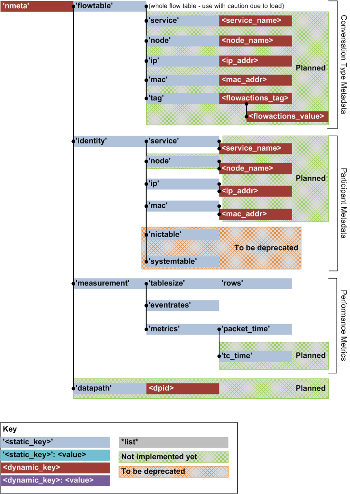

#########
API Guide
#########

The nmeta API provides HTTP read access (no write at this stage) to data
within nmeta. Data includes:

  Conversation Type Metadata
    The types of conversations that are occuring over the network
  Participant Metadata
    Who and what is connected to the network
  Performance Metrics
    How the system is performing

Here is a visualisation of the API hierarchy:

To return the JSON in a human-friendly format, precede the API call with the
jsonpretty.py script (requires install of simplejson):

.. code-block:: text

  sudo python ~/nmeta/misc/jsonpretty.py API_CALL_HERE

*****************
Example API Calls
*****************

Example API Calls to run on local host (jsonpretty.py omitted for brevity):

Conversation Type Metadata
--------------------------

Return the Flow Metadata Table:

.. code-block:: text

  http://127.0.0.1:8080/nmeta/flowtable/

  Returns the whole flow table - use with caution due to load considerations

Participant Metadata
--------------------

Return the Identity MAC structure:

.. code-block:: text

  http://127.0.0.1:8080/nmeta/identity/mac/

Return the Identity IP structure:

.. code-block:: text

  http://127.0.0.1:8080/nmeta/identity/ip/

Return the Identity Service structure:

.. code-block:: text

  http://127.0.0.1:8080/nmeta/identity/service/

Return the Identity NIC Table (old - will be deprecated at some stage):

.. code-block:: text

  http://127.0.0.1:8080/nmeta/identity/nictable/

Return the Identity System Table (old - will be deprecated at some stage):

.. code-block:: text

  http://127.0.0.1:8080/nmeta/identity/systemtable/

Performance Metrics
-------------------

Return the Flow Metadata table size as number of rows:

.. code-block:: text

  http://127.0.0.1:8080/nmeta/measurement/tablesize/rows/

Return the rate at which nmeta is processing events from switches, as events
per second:

.. code-block:: text

  http://127.0.0.1:8080/nmeta/measurement/eventrates/

Return statistics on nmeta per-packet processing time:

.. code-block:: text

  http://127.0.0.1:8080/nmeta/measurement/metrics/packet_time/

