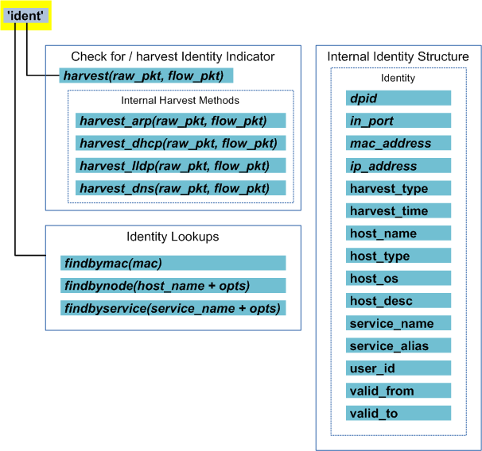
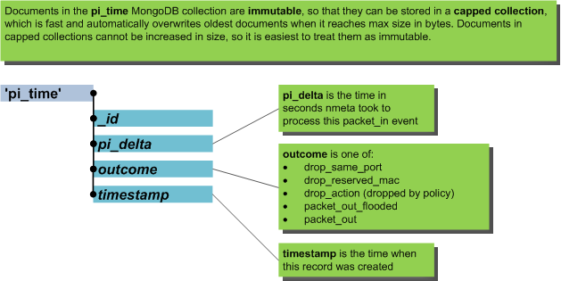
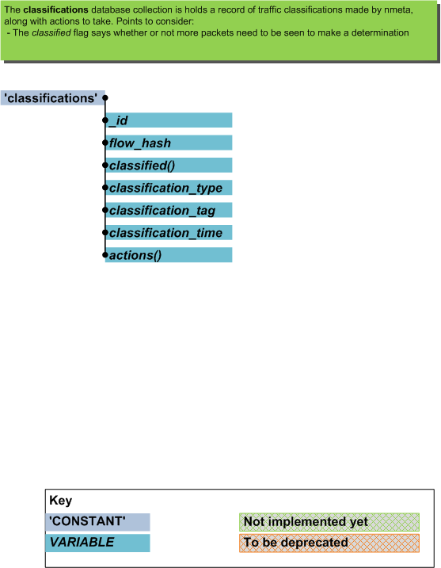

===============
Data Structures
===============

Nmeta uses various data structures to store network metadata related
to participants and flows (conversations).

High level abstractions of participants and flows abstract the details
of the various MongoDB collections.

************************
Information Abstractions
************************

Flows Abstraction
=================

The flows object provides an abstraction of flows (conversations) that
have been seen on the network. Flow metrics are in the context of the flow
that the last packet-in ingested packet belonged to. The packet context
is likewise that of the packet from that event.

.. image:: images/flows_abstraction.png

Classifiers can make use of the flows object to gain easy access to
features of the current flow.

Identities Abstraction
======================

The identities object provides an abstraction for participants (identities)
that are known to nmeta. Classifiers can use the identities object to
look up the identity information of participants.

********************
Database Collections
********************

Nmeta uses capped MongoDB database collections to obviate the need
to maintain size by pruning old entries.

Packet-Ins
==========

MongoDB Collection: packet_ins

.. image:: images/data_struct_packet_ins.png

pi_time
=======

The pi_time database collection stores data on how long nmeta took
to process individual packet-in events, and what type of outcome nmeta
decided upon for the packet.

MongoDB Collection: data_struct_pi_time

Classifications
===============

MongoDB Collection: classifications

Identity Metadata
=================

MongoDB Collection: identities

.. image:: images/data_struct_identities.png
