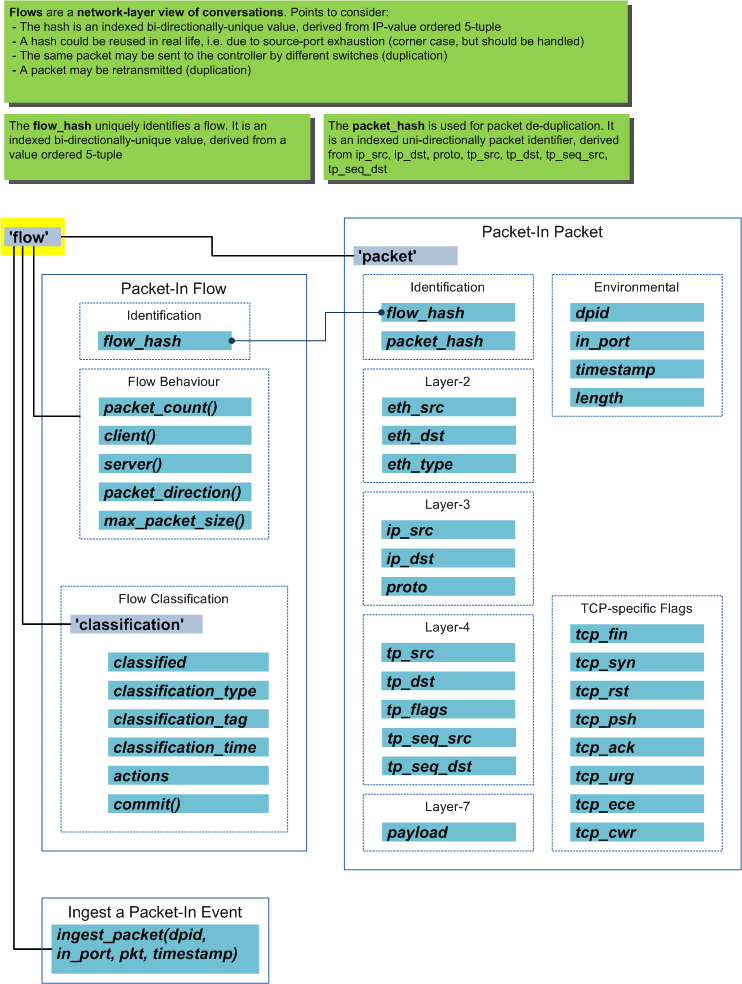
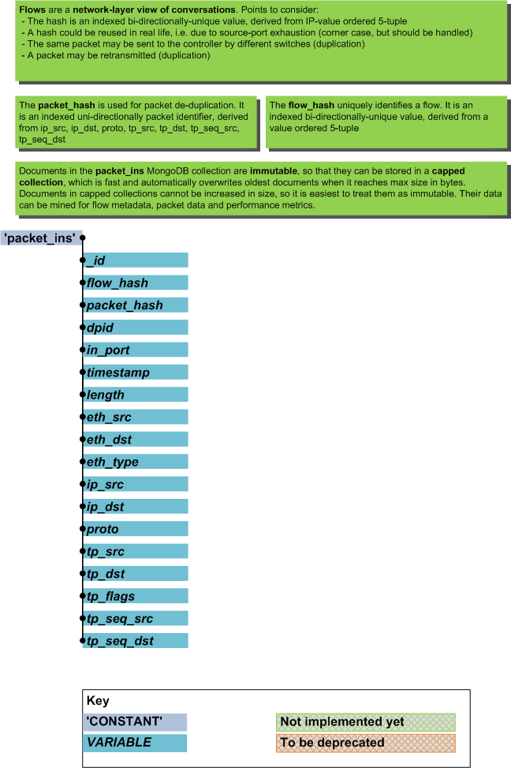
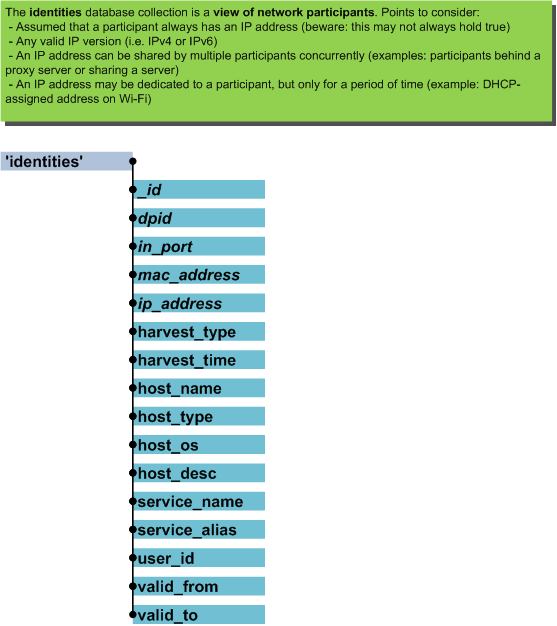

===============
Data Structures
===============

************************
Information Abstractions
************************

Flows Abstraction
=================

The flows object provides an abstraction of flows (conversations) that
have been seen on the network. It defaults to the context of the flow
that the last packet ingested belongs to.

Classifiers can make use of the flows object to gain easy access to
features of the current flow.

Identities Abstraction
======================

The identities object provides an abstraction for participants (identities)
that are known to nmeta. Classifiers can use the identities object to
look up the identity information of participants.

********************
Database Collections
********************

Nmeta uses capped MongoDB database collections to obviate the need
to maintain size by pruning old entries.

Packet-Ins
==========

MongoDB Collection: packet_ins

Identity Metadata
=================

MongoDB Collection: identities

