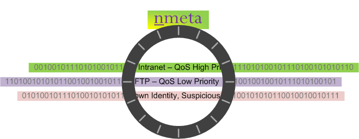
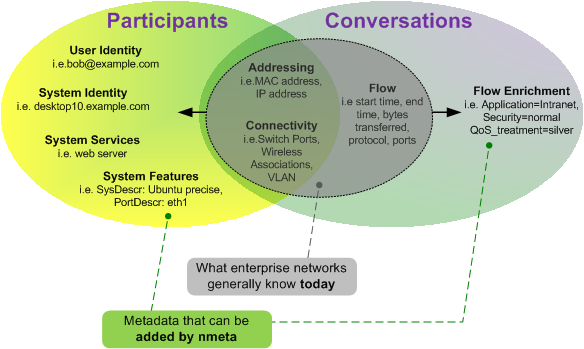

============
Introduction
============

The nmeta *(pronounced en-meta)* project is founded on the belief that
innovation in networks requires a foundation layer of knowledge
about both the participants and their types of conversation.

Today, networks generally have only a limited view of participants
and conversation types

The goal of the nmeta project is to produce network metadata enriched with
participant identities and conversation types to provide a foundation for
innovation in networking.

The production of enriched network metadata requires policy-based control,
and ability to adapt to new purposes through extensibility.

Enriched network metadata has a number of uses, including classifying flows
for QoS, billing, traffic engineering, troubleshooting and security.

.. image:: images/flow_metadata_screenshot3.png

Nmeta is a research platform for traffic classification on Software Defined
Networking (SDN).  It runs on top of the Ryu SDN controller
(see: `<http://osrg.github.io/ryu/>`_).

Design Philosophy
-----------------

The collection and enrichment of flow metadata should be decoupled from
systems that consume it. This abstraction is intended to encourage the
development of innovative new uses for flow metadata.

Policy is used to control how traffic classifiers of many types
(i.e. this is a multiclassifier system) are employed and what actions
they can take.

Flow metadata can be enriched by the policy-controlled classifiers - i.e.
extra data can be added.

The system is designed to work in an online mode such that classifications are
made in a timely manner so that consuming systems may take actions while
the flow is still newly active.

Feature Enhancement Wishlist
----------------------------

See `Issues <https://github.com/mattjhayes/nmeta/issues>`_ for list of
enhancements and bugs

Privacy Considerations
----------------------
Collecting network metadata brings with it ethical and legal considerations
around privacy. Please ensure that you have permission to monitor traffic
before deploying this software.

Disclaimer
----------

This code carries no warrantee whatsoever. Use at your own risk.

How to Contribute
-----------------

Code contributions and suggestions are welcome. Enhancement or bug fixes
can be raised as issues through GitHub.

Please get in touch if you want to be added as a contributor to the project:

Email: `Nmeta Maintainer <mailto:nmeta-maintainer@outlook.com>`_

