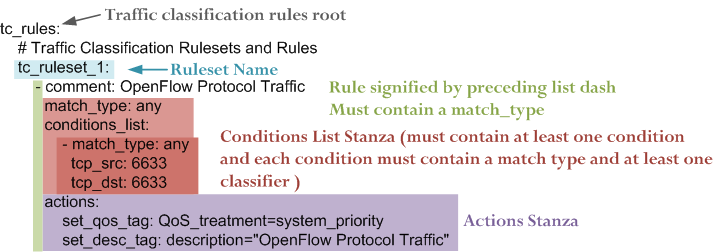
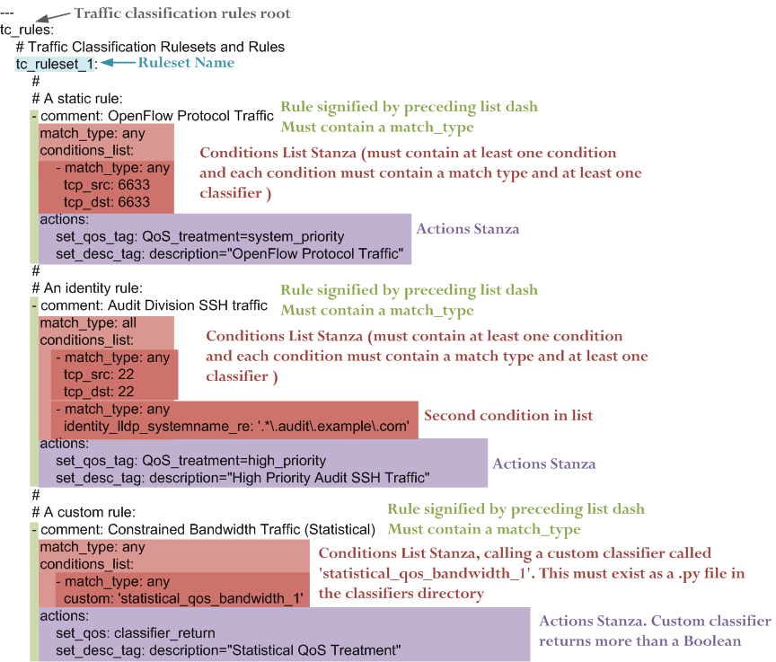

######
Policy
######

The nmeta policy configures how nmeta works with data plane traffic.
This includes traffic classification rules, what classifiers are used,
in what order and what actions are taken.

The policy is designed as a tree with many first level branches and only
a shallow depth.

***************
Policy Location
***************

Nmeta ships with a default policy in the YAML file:

.. code-block:: text

  ~/nmeta/nmeta/config/main_policy.yaml

Do not edit the default policy as it will be overwritten by nmeta
updates.

Create Your Own Policy
======================

Create your own policy by copying the default file to this location:

.. code-block:: text

  ~/nmeta/nmeta/config/user/main_policy.yaml

(note the user directory)

If a main_policy.yaml file is present in the user directory it will completely
override the default policy. Note that a user-defined main policy file will
not be part of the git distribution, as it is excluded in the .gitignore file.

*****************************
Traffic Classification Branch
*****************************

The traffic classification policy is based off a root key *tc_rules*.
This root contains a *ruleset* name (only one ruleset supported at this
stage), which in turn contains one or more *rules*.

Rules
=====

Rules are an ordered list (denoted by preceding dash). Each rule contains:

  Comment
    A *comment* to describe the purpose of the rule (optional). A
    comment must start with the attribute *comment:* and any single-line string
    can follow

  Match Type
    A *match type* is one of:
      *any*
      *all*
      *none*

  Conditions List
    A single *conditions_list* stanza that contains one or more
    *conditions* stanzas

  Actions
    A single *actions* stanza that contains one or more actions

Example simple traffic classification policy with a single rule:

A *conditions_list* stanza contains:

- A match type, consisting of *any* or *all*
- One or more *conditions* as list items (denoted by dash preceding the
  first item)
- One or more *classifiers* (see below)

A *conditions* stanza is a list item in a conditions list and contains:

- A match type is one of:
      *any*
      *all*
      *none*

- One or more *classifiers* (see below)

A *actions* stanza contains one or more attribute/value pairs

Here is a more complex traffic classification policy:

Conditions invoke classifiers. There are three types of classifier supported:

- Static
- Identity
- Custom (Payload / Statistical / Multi-classifier)

Static Classifiers
==================

Static classifiers match on attributes in packet headers, or on environmental
attributes such as port numbers.

Supported attributes are:

:eth_src: Ethernet source MAC address.

  Example:

  .. code-block:: text

    eth_src: 08:00:27:4a:2d:41

:eth_dst: Ethernet destination MAC address.

  Example:

  .. code-block:: text

    eth_dst: 08:00:27:4a:2d:42

:eth_type: Ethernet type. Can be in hex (starting with 0x) or decimal.

  Examples:

  .. code-block:: text

    eth_type: 0x0800

  .. code-block:: text

    eth_type: 35020

:ip_src: IP source address. Can be a single address, a network with a mask in
  CIDR notation, or an IP range with two addresses separated by a hyphen.
  Both addresses in a range must be the same type, and the second
  address must be higher than the first.

  Examples:

  .. code-block:: text

    ip_src: 192.168.56.12

  .. code-block:: text

    ip_src: 192.168.56.0/24

  .. code-block:: text

    ip_src: 192.168.56.12-192.168.56.31

:ip_dst: IP destination address. Can be a single address, a network with a
  mask in CIDR notation, or an IP range with two addresses separated by a
  hyphen. Both addresses in a range must be the same type, and the second
  address must be higher than the first.

  Examples:

  .. code-block:: text

    ip_dst: 192.168.57.40

  .. code-block:: text

    ip_dst: 192.168.57.0/24

  .. code-block:: text

    ip_dst: 192.168.57.36-192.168.78.31

:tcp_src: TCP source port.

  Example:

  .. code-block:: text

    tcp_src: 22

:tcp_dst: TCP destination port.

  Example:

  .. code-block:: text

    tcp_dst: 80

:udp_src: UDP source port.

  Example:

  .. code-block:: text

    udp_src: 123

:udp_dst: UDP destination port.

  Example:

  .. code-block:: text

    udp_dst: 53

Identity Classifiers
====================

All identity classifiers are prefixed with:

.. code-block:: text

  identity_

LLDP systemname may be matched as a regular expression.
The match pattern must be contained in single
quotes. For example, to match system names of \*.audit.example.com, add this
policy condition:

.. code-block:: text

  identity_lldp_systemname_re: '.*\.audit\.example\.com'

Supported attributes are:

:identity_lldp_systemname: Exact match against a system name discovered
  via LLDP. Example:

  .. code-block:: text

    identity_lldp_systemname: bob.example.com

:identity_lldp_systemname_re: Regular expression match against a system name
  discovered via LLDP. Example:

  .. code-block:: text

    identity_lldp_systemname_re: '.*\.audit\.example\.com'

:identity_service_dns: Exact match of either IP address in a flow against a
   DNS domain. Example:

  .. code-block:: text

    identity_service_dns: www.example.com

:identity_service_dns_re: Regular expression match of either IP address in
  a flow against a DNS domain. Example:

  .. code-block:: text

    identity_service_dns_re: '.*\.example\.com'

Custom Classifiers
==================

Nmeta supports the creation of custom classifiers.

All custom classifiers have the attribute:

.. code-block:: text

  custom

The value determines the custom .py file to load from the nmeta/classifiers
directory

For example, the following condition loads a custom classifier file :code:`~/nmeta/nmeta/classifiers/statistical_qos_bandwidth_1.py`:

.. code-block:: text

  custom: statistical_qos_bandwidth_1

Actions
=======

Actions are specific to a rule, and define what nmeta should do when the rule is matched.
Multiple actions can be defined on a rule.

Supported attributes are:

:drop: Drop the packet

  No flow modification or packet-out will occur. The packet will however
  appear in metadata and does add load to the controller.

  Values can be:

  - at_controller
  - at_controller_and_switch

  Example:

  .. code-block:: text

    drop: at_controller_and_switch

  A drop action with 'at_controller_and_switch' value will install a flow entry
  with no actions (which implicitly drops) onto the switch that sent the
  matching packet to the controller. Be aware that nmeta will generate a
  fine-grained match for this drop rule that may not align with what is
  specified in the policy. It builds the rule based on the classified packet
  and will do a match on IPs & TCP or UDP destination port for TCP or UDP or
  IPs for other IP traffic. It will not apply a rule for non-IP traffic.

:qos_treatment: Specify QoS treatment for flow.

  Values can be:

  - default_priority
  - constrained_bw
  - high_priority
  - low_priority
  - classifier_return

  Example:

  .. code-block:: text

    qos_treatment: classifier_return

:set_desc: Set description for the flow. This is a convenience for humans.

  Example:

  .. code-block:: text

    set_desc: "This is a flow type description"

********************
QoS Treatment Branch
********************

Quality of Service (QoS) treatment parameters are configured in main policy
under the qos_treatment root directive. They map qos action values to
queue numbers. Example:

.. code-block:: YAML

  qos_treatment:
    # Control Quality of Service (QoS) treatment mapping of
    #  names to output queue numbers:
    default_priority: 0
    constrained_bw: 1
    high_priority: 2
    low_priority: 3

The QoS queue numbers are arbitrary and are used to map packets and flows
to queues that have been configured on the switch (separate to nmeta).

****************
Port Sets Branch
****************

Port Sets are used to abstract a set of switches/ports so that they
can be referenced elsewhere in the policy. Port Sets are located under the
root key *port_sets*.

Example:

.. code-block:: YAML

    port_sets:
        # Port Sets control what data plane ports policies and
        #  features are applied on. Names must be unique.
        port_set_list:
            - name: port_set_location_internal
                port_list:
                - name: VirtualSwitch1-internal
                    DPID: 8796748549206
                    ports: 1-3,5,66
                    vlan_id: 0
                - name: VirtualSwitch2-internal
                    DPID: 255
                    ports: 3,5
                    vlan_id: 0

In this example, the port set *port_set_location_internal* refers to
specific ports on the switches with DPIDs of 8796748549206 and 255.

****************
Locations Branch
****************

Locations are a policy-defined aspect of an identity that are
based on the source or destination DPID/port, which is looked up
against a list that links location names to port sets.

Locations are located under the root key *locations*.

A default location must be defined.

Example:

.. code-block:: YAML

    locations:
        # Locations are logical groupings of ports. Takes first match.
        locations_list:
            - name: internal
              port_set_list:
                - port_set: port_set_location_internal
            - name: external
              port_set_list:
                - port_set: port_set_location_external
        default_match: unknown
