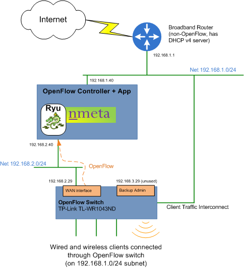
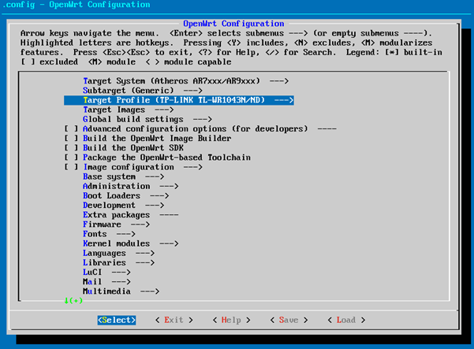
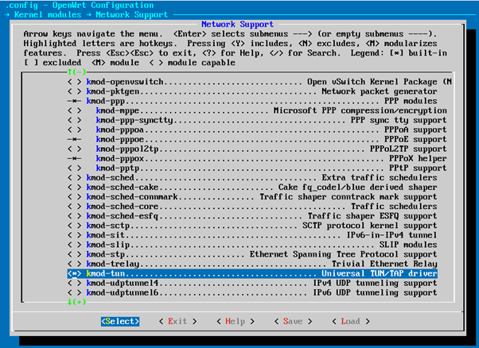
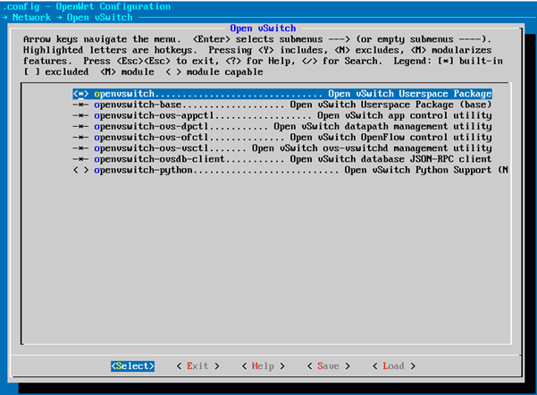
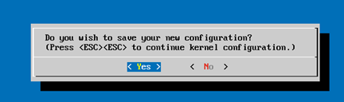
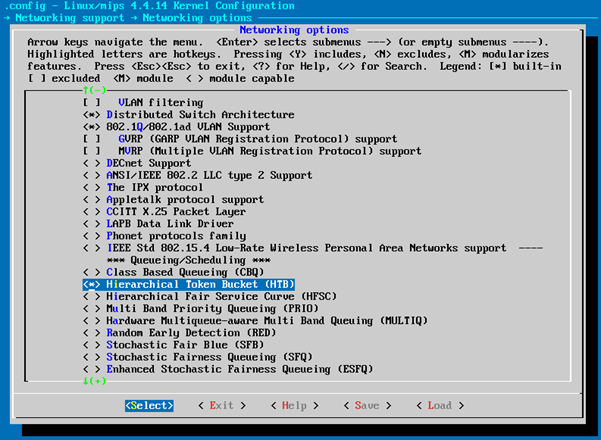
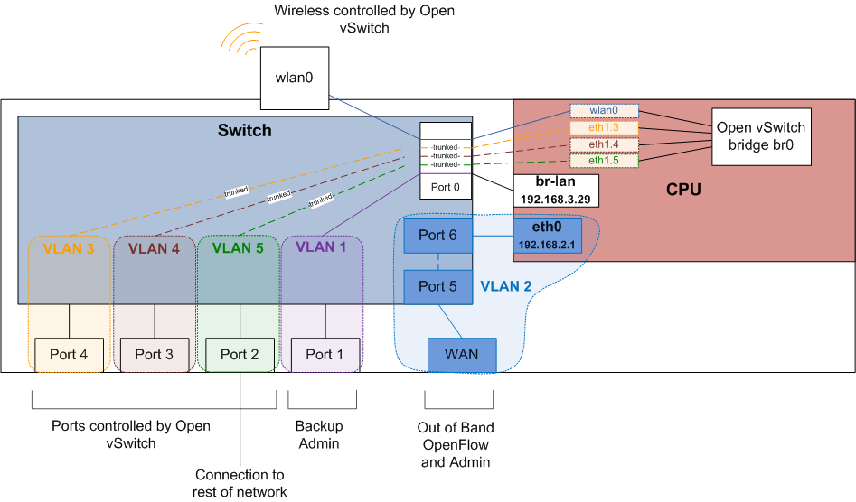

###########
Build a Lab
###########

To run nmeta, you're going to need an OpenFlow network to provide the data
plane connectivity.

There are many different options for building a lab network. The
choice is likely to come down to what resources you have and the use cases
you want to test.

Virtual labs are easy to set up and don't require specialised hardware,
but aren't useful for testing devices in the real world.

Physical labs are harder to construct and require hardware, but can be
used to connect real-world devices.

OpenFlow SDN disaggregates the data and control planes;
this means the lab environments can be used with different
OpenFlow controllers and apps, should you wish.

*************
Physical Labs
*************

OpenWRT with Open vSwitch
=========================

This lab is based on a TP-Link TL-WR1043ND Hardware Version 2.1 home router
that is re-flashed to run OpenWRT with Open vSwitch running OpenFlow (yes,
that's three different pieces of software that start with the word 'Open'...)

Be warned that reflashing a router is likely to void it's warrantee, and may
result in the router becoming 'bricked', whereby it is unrecoverable. Continue
**at your own risk**...

You'll also need a physical Linux PC with two NICs that has been built
with nmeta as per the install instructions.

The configuration of the lab is shown below:

These instructions haven't been tested end-to-end. Please raise an issue if
there are changes required.

Convert Router to OpenWRT
-------------------------

Start by converting the TP-Link TL-WR1043ND to running OpenWRT as per the
instructions from the OpenWRT website at:

`<https://wiki.openwrt.org/toh/tp-link/tl-wr1043nd>`_

When router is successfully running OpenWRT, proceed to the next step:

Configure the Router
--------------------

Apply a basic configuration to the router to allow remote access.

Connect a device with SSH capability to a LAN port on the TP-Link, set a static IP
address of 192.168.1.2 mask 255.255.255.0 (or use DHCP) and SSH to 192.168.1.1.

Set root password to something secure, and not used elsewhere.

Compile OpenWRT with Open vSwitch Image
---------------------------------------

Note: If you don't want to compile your own image then consider using 
an image from `<https://github.com/mattjhayes/TP-Link-TL-1043ND-OpenvSwitch>`_
and jump ahead to `<http://nmeta.readthedocs.io/en/develop/userguide/build_a_lab.html#upgrade>`_

Compilation Host
^^^^^^^^^^^^^^^^

To compile the router firmware, use an Ubuntu 16.04.2 server or desktop
(can be virtual) with at least 30GB of disk space.

Clone OpenWRT
^^^^^^^^^^^^^

On the compilation host, clone OpenWRT (note: GitHub, not direct from OpenWRT site):

.. code-block:: text

  git clone https://github.com/openwrt/openwrt.git 

Install Dependancies
^^^^^^^^^^^^^^^^^^^^

.. code-block:: text

  sudo apt-get update
  sudo apt-get install git-core build-essential libssl-dev libncurses5-dev unzip gawk zlib1g-dev
  sudo apt-get install subversion mercurial
  sudo apt-get install gcc-multilib flex gettext

Update Feeds
^^^^^^^^^^^^

.. code-block:: text

  cd openwrt
  ./scripts/feeds update -a
  ./scripts/feeds install -a

Make MenuConfig
^^^^^^^^^^^^^^^

.. code-block:: text

  make menuconfig

Change Target Profile to suit hardware (select *TP-LINK TL-WR1043N/ND* for
TP-Link TL-WR1043ND Hardware Version 2.1):

Then select Kernel Modules -> Network Support -> kmod-tun:

Exit out back to main screen, then select *Network ->  Open vSwitch* and
select:

Save on exit:

This one takes a while:

.. code-block:: text

  make kernel_menuconfig

When finished brings up another menu. Navigate to 
*Networking support -> Networking options* and select
*Hierarchical Token Bucket (HTB)*:

Run Make
^^^^^^^^

This may take a couple of hours...

.. code-block:: text

  make

Patch for Wi-Fi Authentication
^^^^^^^^^^^^^^^^^^^^^^^^^^^^^^

Standard OpenWRT build with Open vSwitch cannot run authentication on Wi-Fi,
see: `<https://forum.openwrt.org/viewtopic.php?id=59129>`_

We apply a patch to fix this:

.. code-block:: text

  cd ~/openwrt/package/network/services/hostapd/
  vi 710-hostapd-Initial-OVS-support.patch

Paste in contents of patch (starting from the ---) from `<https://github.com/helmut-jacob/hostapd/commit/c89daaeca4ee90c8bc158e37acb1b679c823d7ab.patch>`_
Save and exit.

Patch with Quilt. Install quilt:

.. code-block:: text

  sudo apt install quilt

In home dir, need to run this once:

.. code-block:: text

  cat > ~/.quiltrc <<EOF
  QUILT_DIFF_ARGS="--no-timestamps --no-index -p ab --color=auto"
  QUILT_REFRESH_ARGS="--no-timestamps --no-index -p ab"
  QUILT_SERIES_ARGS="--color=auto"
  QUILT_PATCH_OPTS="--unified"
  QUILT_DIFF_OPTS="-p"
  EDITOR="nano"
  EOF

Run this from ~/openwrt/

.. code-block:: text

  make package/network/services/hostapd/{clean,prepare} V=s QUILT=1

cd to created directory:

.. code-block:: text

  cd ~/openwrt/build_dir/target-mips_34kc_musl-1.1.16/hostapd-wpad-mini/hostapd-2016-06-15/

Apply existing patches:

.. code-block:: text

  quilt push -a

Now at patch 710-hostapd-Initial-OVS-support.patch. Run this:

.. code-block:: text

  quilt edit src/main.c

Run this:

.. code-block:: text

  quilt refresh

Change dir to the build root and run 

.. code-block:: text

  cd ../../../../
  make package/network/services/hostapd/update V=s

Then run:

.. code-block:: text

  make package/network/services/hostapd/{clean,compile} package/index V=s

Then run:

.. code-block:: text

  make

Copy Image
^^^^^^^^^^
Navigate to the directory where the output files are:

.. code-block:: text

  cd bin/ar71xx

There should be multiple files in the directory, including this file:

.. code-block:: text

  openwrt-ar71xx-generic-tl-wr1043nd-v2-squashfs-sysupgrade.bin

Use SCP to copy the appropriate file to the router:

.. code-block:: text

  scp ./openwrt-ar71xx-generic-tl-wr1043nd-v2-squashfs-sysupgrade.bin USERNAME@192.168.1.1:tmp/

Upgrade
-------

Note: consider backing up config etc first...

Once image file is confirmed as being in the /tmp directory on the TPLink,
and you're happy you've backed up your configurations, run the sysupgrade:

.. code-block:: text

  sysupgrade -v /tmp/openwrt-ar71xx-generic-tl-wr1043nd-v2-squashfs-sysupgrade.bin

Configure OpenWRT
-----------------

OpenWRT needs to be configured to work with Open vSwitch. The configuration
has been tested, but needs to be changed to meet your requirements.

The following diagram shows how OpenWRT with Open vSwitch is configured
on the TP-Link hardware:

Dropbear
^^^^^^^^

Configure Dropbear (SSH server) to listen on the WAN interface, in addition
to the LAN interface. This gives an additional way to access 
the device to administer it, lowering the risk of bricking it.

Note: not a great idea doing this if Internet-facing for security reasons,
so remember to remove WAN config if you ever convert device back to an
Internet router.

Backup dropbear config:

.. code-block:: text

  cp /etc/config/dropbear /etc/config/dropbear.original

Add these lines to /etc/config/dropbear for WAN, full file is:

.. code-block:: text

  config dropbear
          option PasswordAuth 'on'
          option Port '22'
          option Interface 'lan'

  config dropbear
          option PasswordAuth 'on'
          option Port '22'
          option Interface 'wan'

Firewall
^^^^^^^^

Firewall (/etc/config/firewall) should be default permissive policy:

.. code-block:: text

  config defaults
          option syn_flood        1
          option input            ACCEPT
          option output           ACCEPT
          option forward          ACCEPT

Network
^^^^^^^

Backup network config:

.. code-block:: text

  cp /etc/config/network /etc/config/network.original

This is the new complete */etc/config/network* file:

.. code-block:: text

  config interface 'loopback'
          option ifname 'lo'
          option proto 'static'
          option ipaddr '127.0.0.1'
          option netmask '255.0.0.0'

  config interface 'lan'
          option ifname 'eth1'
          option force_link '1'
          option type 'bridge'
          option proto 'static'
          option ipaddr '192.168.3.29'
          option netmask '255.255.255.0'

  config interface 'wan'
          option ifname 'eth0'
          option proto 'static'
          option ipaddr '192.168.2.29'
          option netmask '255.255.255.0'
          option defaultroute '1'
          option gateway '192.168.2.40'
          option dns '8.8.8.8'

  config switch
          option name 'switch0'
          option reset '1'
          option enable_vlan '1'

  config switch_vlan
          option device 'switch0'
          option vlan '1'
          option ports '0 4'

  config switch_vlan
          option device 'switch0'
          option vlan '2'
          option ports '5 6'

  config switch_vlan
          option device 'switch0'
          option vlan '3'
          option ports '0t 1'

  config switch_vlan
          option device 'switch0'
          option vlan '4'
          option ports '0t 2'

  config switch_vlan
          option device 'switch0'
          option vlan '5'
          option ports '0t 3'

  config interface
          option ifname 'eth1.3'
          option proto 'static'
          option ipv6 '0'

  config interface
          option ifname 'eth1.4'
          option proto 'static'
          option ipv6 '0'

  config interface
          option ifname 'eth1.5'
          option proto 'static'
          option ipv6 '0'

  config interface 'wan6'
          option proto 'dhcpv6'
          option ifname '@wan'
          option reqprefix 'no'

  config interface
          option ifname 'br0'
          option proto 'static'

  config interface
          option ifname 'wlan0'
          option proto 'static'

Wireless
^^^^^^^^

Backup wireless config:

.. code-block:: text

  cp /etc/config/wireless /etc/config/wireless.original

Take note of the items in CAPITALS that need you to fill in appropriate values.
This is the new complete */etc/config/wireless* file:

.. code-block:: text

  config wifi-device 'radio0'
          option type 'mac80211'
          option channel '11'
          option hwmode '11g'
          option path 'platform/qca955x_wmac'
          option htmode 'HT20'
          option log_level '1'

  config wifi-iface
          option device 'radio0'
          option network 'wlan0'
          option mode 'ap'
          option ssid 'YOUR_SSID_HERE'
          option encryption 'psk2'
          option key 'YOUR_KEY_HERE'

Configure Open vSwitch
----------------------

Now it's time to configure Open vSwitch by setting up bridge *br0*, adding
ports to it, then setting it to talk OpenFlow to the Controller:

.. code-block:: text

  ovs-vsctl add-br br0
  ovs-vsctl add-port br0 eth1.3
  ovs-vsctl add-port br0 eth1.4
  ovs-vsctl add-port br0 eth1.5
  ovs-vsctl add-port br0 wlan0
  ovs-vsctl set-controller br0 tcp:192.168.2.40:6633

Configure Aliases
-----------------

Aliases are useful for frequently run commands. Here are some suggested
aliases.

Edit file */etc/profile* and add these lines:

.. code-block:: text

  # OpenWRT Network Commands:
  alias nwr='/etc/init.d/network restart'

  # Open vSwitch Commands:
  alias ovshow='ovs-vsctl show'
  alias ovmacs='ovs-appctl fdb/show br0'
  alias ovrestart='/etc/init.d/openvswitch restart'

  # Open vSwitch OpenFlow Commands:
  alias ofshow='ovs-ofctl show br0'
  alias offlows='ovs-ofctl dump-flows br0'
  alias ofports='ovs-ofctl dump-ports br0'

Log out and back in again to enable new aliases.

Cabling
-------

Wire the environment together as per earlier diagram, and ensure the
Linux PC has it's network interfaces configured correctly.

Checks
------

Using our aliases, here are checks to run:

.. code-block:: text

  # ovshow
  <snip>
    Bridge "br0"
        Controller "tcp:192.168.2.40:6633"
            is_connected: true
        Port "br0"
            Interface "br0"
                type: internal
        Port "wlan0"
            Interface "wlan0"
        Port "eth1.3"
            Interface "eth1.3"
        Port "eth1.4"
            Interface "eth1.4"
        Port "eth1.5"
            Interface "eth1.5"

Note the *is_connected: true*. This means OpenFlow has been established
to the controller.

Links
-----

Instructions were based on these tutorials:

`Building and Configuring Open vSwitch on OpenWrt for Cloud Networking byPravin R. <http://www.zymr.com/building-and-configuring-open-vswitch-on-openwrt-for-cloud-networking/>`_
`Turning TP-LINK WR1043NDv2.1 router into OpenFlow-enabled switch by Lucas Burson <http://blog.ljdelight.com/turning-tp-link-wr1043ndv2-1-router-into-openflow-enabled-switch/>`_

-------------------------------------------------------------------------------

************
Virtual Labs
************

Mininet with Vagrant
====================

UNDER CONSTRUCTION

In this lab we use `Vagrant <https://www.vagrantup.com/>`_ to 
automate the start up and build of multiple `VirtualBox <https://www.virtualbox.org/>`_ 
Ubuntu guests.

These instructions assume you're running Windows, but should be easily
adapted to other operating systems as most of the work happens within the
virtual environment.

Install VirtualBox
------------------

Download and install VirtualBox from `<https://www.virtualbox.org/wiki/Downloads>`_

Install Vagrant
---------------

Download and install Vagrant from `<https://www.vagrantup.com/>`_

Download a box
--------------

We will use the `bento <https://app.vagrantup.com/bento>`_ box of Ubuntu
16.04 in this lab. Download this box on your host machine with:

.. code-block:: text

  vagrant box add bento/ubuntu-16.04

Choose *virtualbox* option from menu

Clone Vagrant Repo
---------------------

Clone the Vagrant repo from `<https://github.com/mattjhayes/Vagrant>`_ onto
your host machine.

Start the Guest
---------------

In a command prompt, from base of cloned repo, navigate to
the *SDN_Labs\Mininet_Ryu_nmeta* directory:

.. code-block:: text

  cd SDN_Labs\Mininet_Ryu_nmeta

Start the guest by running this on the host machine command prompt:

.. code-block:: text

  vagrant up

When the guest is up, connect to it with SSH on localhost:2222

username/password are both *vagrant*

run nmeta (from alias):

.. code-block:: text

  nm

Start a second SSH session and run the nmeta api:

.. code-block:: text

  nma

In a third SSH session run Mininet:

.. code-block:: text

  mnt

TBD - UNDER CONSTRUCTION

-------------------------------------------------------------------------------

VirtualBox with Vagrant
=======================

UNDER CONSTRUCTION

In this lab we use `Vagrant <https://www.vagrantup.com/>`_ to 
automate the start up and build of multiple `VirtualBox <https://www.virtualbox.org/>`_ 
Ubuntu guests.

These instructions assume you're running Windows, but should be easily
adapted to other operating systems as most of the work happens within the
virtual environment.

Install VirtualBox
------------------

Download and install VirtualBox from `<https://www.virtualbox.org/wiki/Downloads>`_

Install Vagrant
---------------

Download and install Vagrant from `<https://www.vagrantup.com/>`_

Download a box
--------------

We will use the `bento <https://app.vagrantup.com/bento>`_ box of Ubuntu
16.04 in this lab. Download this box on your host machine with:

.. code-block:: text

  vagrant box add bento/ubuntu-16.04

Choose *virtualbox* option from menu

Clone Vagrant Repo
---------------------

Clone the Vagrant repo from `<https://github.com/mattjhayes/Vagrant>`_ onto
your host machine.

Start the Guest
---------------

In a command prompt, from base of cloned repo, navigate to
the *SDN_Labs\Ryu_nmeta_SystemTestLab* directory:

.. code-block:: text

  cd SDN_Labs\Ryu_nmeta_SystemTestLab

Start the guest by running this on the host machine command prompt:

.. code-block:: text

  vagrant up

When the guests are up, connect to the controller with SSH on localhost:2203
(first guests is port 2222 then ports 2200 and upwards for other guests)

username/password are both *vagrant*

run nmeta (from alias):

.. code-block:: text

  nm

Start a second SSH session and run the nmeta api:

.. code-block:: text

  nma

TBD - UNDER CONSTRUCTION

