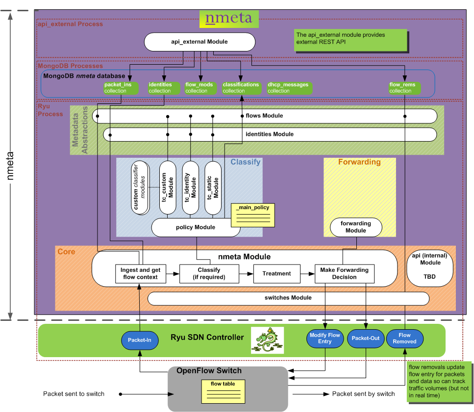
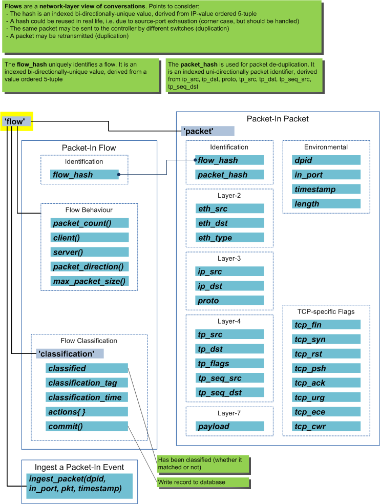
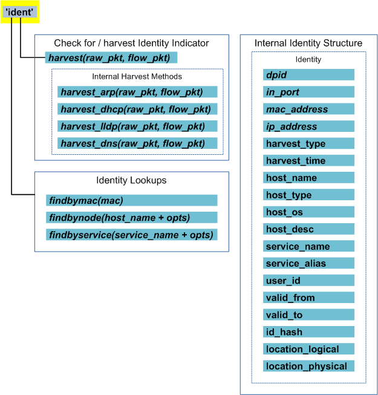
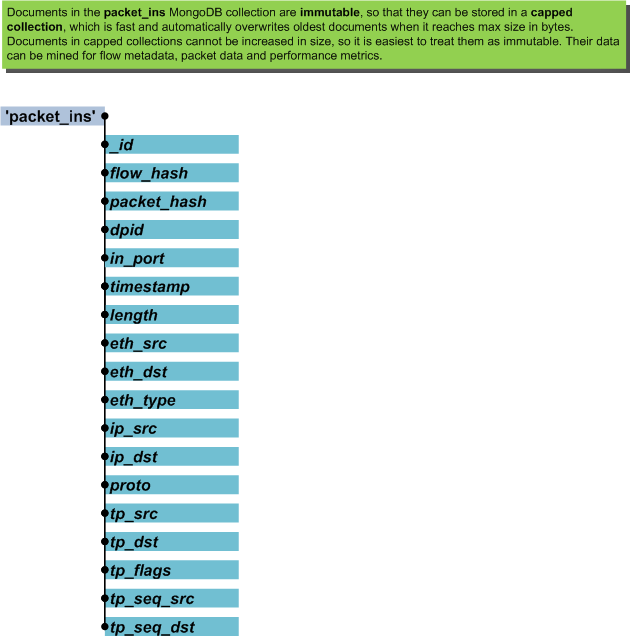
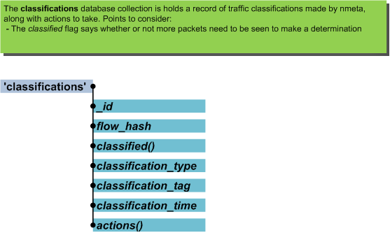

#######
Develop
#######

Want to develop the nmeta code and contribute to the codebase? Great! Read on
for documentation on how the code is structured and some of the principles.

**************
Code Structure
**************

Nmeta runs in 3 separate processes.

* The *Ryu process* runs within the context of the Ryu OpenFlow controller.
* The *MongoDB process* is a MongoDB database
* The *api_external* process runs the external REST API

***************
Data Structures
***************

Nmeta uses various data structures to store network metadata related
to participants and flows (conversations).

High level abstractions of participants and flows abstract the details
of the various MongoDB collections.

Information Abstractions
========================

Flows Abstraction
-----------------

The flows object provides an abstraction of flows (conversations) that
have been seen on the network. Flow metrics are in the context of the flow
that the last packet-in ingested packet belonged to. The packet context
is likewise that of the packet from that event.

Classifiers can make use of the flows object to gain easy access to
features of the current flow.

Identities Abstraction
----------------------

The identities object provides an abstraction for participants (identities)
that are known to nmeta. Classifiers can use the identities object to
look up the identity information of participants.

Database Collections
====================

Nmeta uses capped MongoDB database collections to obviate the need
to maintain size by pruning old entries.

Packet-Ins
----------

MongoDB Collection: packet_ins

pi_time
-------

The pi_time database collection stores data on how long nmeta took
to process individual packet-in events, and what type of outcome nmeta
decided upon for the packet.

MongoDB Collection: data_struct_pi_time

.. image:: images/data_struct_pi_time.png

Classifications
---------------

MongoDB Collection: classifications

Identity Metadata
-----------------

MongoDB Collection: identities

.. image:: images/data_struct_identities.png

*******
Logging
*******

Logging is configured separately for syslog and to the console, and levels
are configurable per Python module. The log format is also customisable.

Logging configuration is controlled by the system configuration YAML file.

Logging settings are configured separately for *console* and
*syslog* logging.

By default, logging levels are set to INFO.

Supported logging levels are:

- CRITICAL
- ERROR
- WARNING
- INFO
- DEBUG

To change the default logging levels, create a user configuration
YAML file (if it doesn't already exist) as the following filename:

.. code-block:: text

  ~/nmeta/nmeta/config/user/config.yaml

Override specific settings from the default configuration file from the
directory below.

Example:

.. code-block:: text

  # Set nmeta.py console logging to DEBUG level:
  nmeta_logging_level_c: DEBUG
